<h1 align="center">Hi 👋, I'm Oğuz Gençer</h1>
<h3 align="center">Electronics Engineer · PhD Researcher in Nanoscience & Biomedical Engineering @ İTÜ</h3>

  
  
  
  
  

### 🔬 Research Focus

PhD work on **conductive nanofiber coatings for neural microelectrode arrays (MEA)** — dual-use electrical + optical electrode materials (PEDOT:PSS, carbon nanomaterials, electrospun scaffolds) for low-impedance neural recording and optical microscopy compatibility.

- 🧪 **Domains:** Nanoelectronics · Quantum dot synthesis & characterization · Neural interfaces
- 🛠️ **Hardware:** Altium · Xilinx FPGAs · µC/µP design
- 💻 **Software:** C · Java · Python
- 📊 **Simulation & modeling:** MATLAB/Simulink · LTspice · TCAD · AutoCAD
- 👯 Open to collaboration on **simulation, modeling & scientific data visualization**
- 📌 Public projects below — for private/research repos, feel free to reach out.

### 🧰 Tech Stack

**Languages**

**Scientific Computing & Data**

**Hardware & EDA**

**Simulation & Modeling**

**Tools & Environment**

### 📈 GitHub Metrics

  

<b>⚡ My motto:</b> <i>"Bees don't waste time trying to explain to flies that honey is better than shit."</i>

